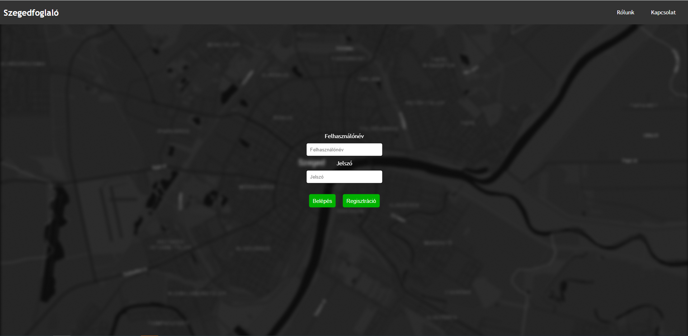
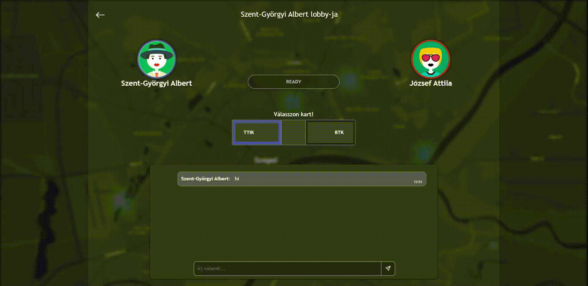
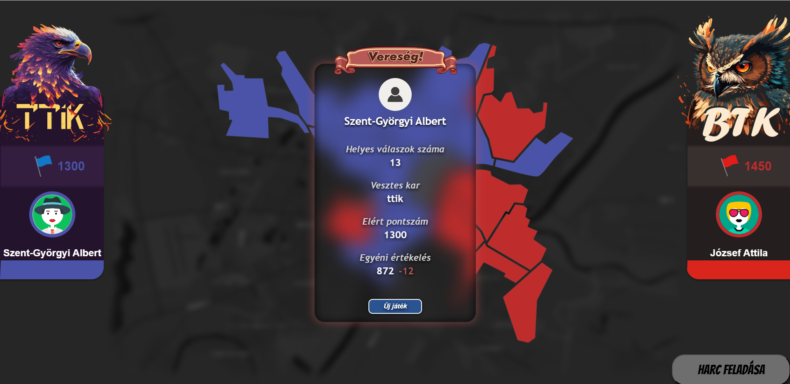

# Szegedfoglalo
Szegedfoglalo is a captivating two-player online quiz game that immerses you in the fascinating world of Szeged, a vibrant city with a rich cultural heritage. In this game, you and your opponent engage in a thrilling battle to conquer territories and gather valuable points by answering questions about Szeged. Prepare yourself for an exhilarating gameplay experience as you explore the city's landmarks, history, and more.

## Note
This repository is only one of the five part of the whole project, it will not work alone.
However, you can try the game out at [Szegedfoglalo's homepage](http://szegedfoglalo.ddns.net/) if the hosting is still up.

## Features
- **Territory Reservation**: Begin the game by strategically reserving territories on the map. Each territory represents a different location or aspect of Szeged, and your goal is to claim as many territories as possible to gain an advantage.

- **Quiz Challenges**: Test your knowledge about Szeged through a series of challenging quiz questions. Answer correctly to secure your hold on territories and earn valuable points. Be prepared to delve into the city's diverse topics, ranging from historical events to famous landmarks.

- **University Faculty Wars**: Once the reservation phase concludes, engage in intense battles with your opponent to occupy five prestigious university faculties. These faculties are the ultimate prize, granting you additional points and increasing your chances of victory. Prepare for a thrilling clash between the esteemed Faculty of Natural Sciences and the prestigious Faculty of Humanities.

## My work
- **Group Collaboration**: Szegedfoglalo was developed as part of an Agile Software Engineering course by a passionate group of 25 individuals. Over the course of four to five months, we worked tirelessly in five teams, each assigned to a different project. At the culmination of our efforts, we seamlessly merged all five projects to create this extraordinary game, providing you with an expansive and immersive gaming experience.

- **Scrum Master and Backend Developer**: As the Scrum Master and backend developer for this project, I meticulously orchestrated the development process and ensured the smooth integration of various components. Drawing upon my expertise, I strived to create a seamless and enjoyable gaming experience for all players.

## Acknowledgements
I would like to express my gratitude to our mentors of the Agile Software Engineering course and our fellow teammates for their dedication and hard work in bringing Szegedfoglalo to life. Special thanks to the Faculty of Natural Sciences and the Faculty of Humanities for providing the inspiration behind the eternal war in this game.

# Screenshots of pages
## Login

## Menu / Game Rules / Profile / Start Game

## Lobby with chat

## Gameplay

## Result

